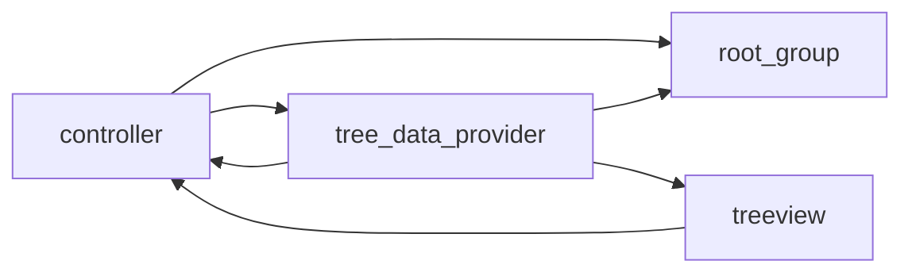

# Bookmark X

Drag-and-drop, grouping, sorting bookmarklet plugin

> If you encounter any problems with the plugin, feel free to raise an issue on [my github](https://github.com/tommyme/vscode_bookmark_x) to help me make it better!
> and feel free to suggest improvements to the code implementation

## Quick Start
- there is no default key map, define yourself.
- Run command from the command palette by pressing (`Ctrl+Shift+P` or `Cmd+Shift+P` on Mac) and type `bookmark_x ...`

## features
- drag and drop
- customized bookmark svg icon(set in settings)
- nested group
- activate group(new bookmarks'll be added here)
- bookmark count(shown on badge)

## all avaliable commands
- `toggle bookmark`: toggle bookmark on current line
- `toggle lable bookmark`: toggle bookmark and input label
- `add group`: add a group
- `clear data`: clear all data in extension
- `load bookmarks in workspace`: load bookmarks in `{your_workspace}/.vscode/bookmark_x.json`
- `save bookmarks in workspace`: save bookmarks in `{your_workspace}/.vscode/bookmark_x.json`
- `reveal bookmark in current line`: show the bookmark on current line

## Roadmap
- [ ] multi drag and drop support
- [ ] save customized svg bookmark icon in extension for select and switch
- [ ] better performance
- [ ] reveal bookmark in tree view
- [ ] bookmark search

## develop

Commonly used object relation figure is shown below.

### tobe improved
- Bookmark Movement Logic