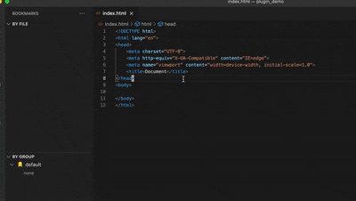

# bookmarks-plugin
Bookmark plugin with grouping support

## Get up and running straight away
* Run command from the command palette by pressing (`Ctrl+Shift+P` or `Cmd+Shift+P` on Mac) and typing `toggleBookmark`.

## List of available commands
* bookmark-plugin: toggle bookmark
* bookmark-plugin: toggle label bookmark
* bookmark-plugin: add group