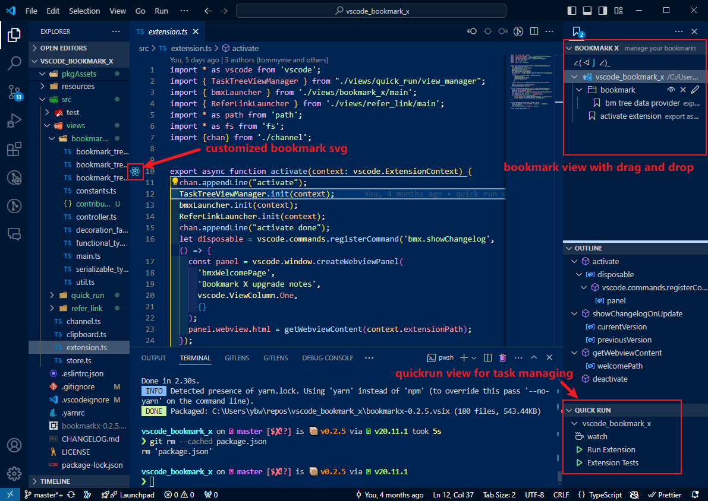
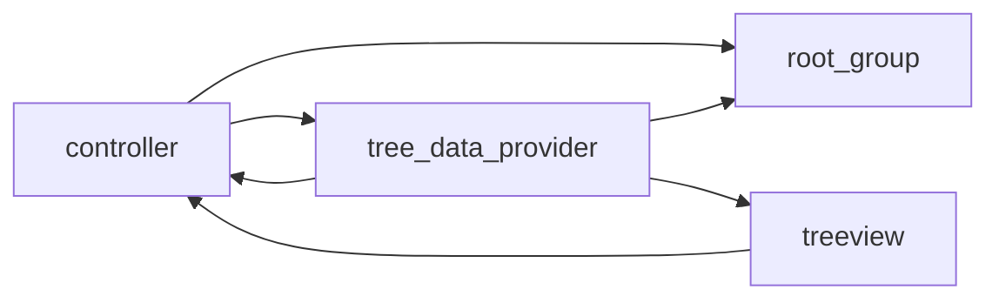

# Bookmark X

Drag-and-drop, grouping, sorting bookmarklet plugin

> If you encounter any problems with the plugin, feel free to raise an issue on [my github](https://github.com/tommyme/vscode_bookmark_x) to help me make it better!
> and feel free to suggest improvements to the code implementation

## Quick Start
- there is no default key map, define yourself.
- there many useful commands defined in vscode command palette, if you are not familiar with it, I suggest you read [this document](https://code.visualstudio.com/docs/getstarted/userinterface#_command-palette), it will greatly improve your efficiency in using vscode.
- Run command from the command palette by pressing (`Ctrl+Shift+P` or `Cmd+Shift+P` on Mac) and type `bookmark_x ...`

## features
- drag and drop
- customized bookmark svg icon(set in settings)
- nested group
- activate group(new bookmarks'll be added here)
- bookmark count(shown on badge)

## all avaliable commands
- `toggle bookmark`: toggle bookmark on current line
- `toggle lable bookmark`: toggle bookmark and input label
- `add group`: add a group
- `clear data`: clear all data in extension
- `load bookmarks in workspace`: load bookmarks in `{your_workspace}/.vscode/bookmark_x.json`
- `save bookmarks in workspace`: save bookmarks in `{your_workspace}/.vscode/bookmark_x.json`
- `reveal bookmark in current line`: show the bookmark on current line

## Roadmap
- [x] multi drag and drop support
- [ ] save customized svg bookmark icon in extension for select and switch
- [ ] better performance
- [x] reveal bookmark in tree view
- [ ] bookmark search
- [ ] pin bookmark/group

## Known issue
- when using <kbd>alt</kbd> + <kbd>up</kbd>/<kbd>down</kbd> to move line, you need to pay attension to the bookmarks of the rows you are moving.
- If two adjacent lines have bookmarks, deleting from the beginning of the next line to merge the two lines will cause the bookmarks to merge, and the merging of bookmarks cannot be undone.
- when using git or svn to pull code from repo, If there are bookmarks in the updated file, it is not possible to anticipate changes to bookmarks. bookmarks in other files are unaffected.
- Formatter large changes to the document may also cause bookmarks to be misplaced

## development

Commonly used object relation figure is shown below.

### tobe improved
- Bookmark Movement Logic

# migration guide
## from 0.1 to 0.2

bookmark x 0.1 and 0.2 are using different data strcture to store bookmark data.

if your bookmark x is upgraded to 0.2 and there is no bookmark data, **don't worry, your data is safe**.

you can switch to old version bookmark x and use command `>save bookmarks in workspace` in command palette to save your bookmarks in project with json format